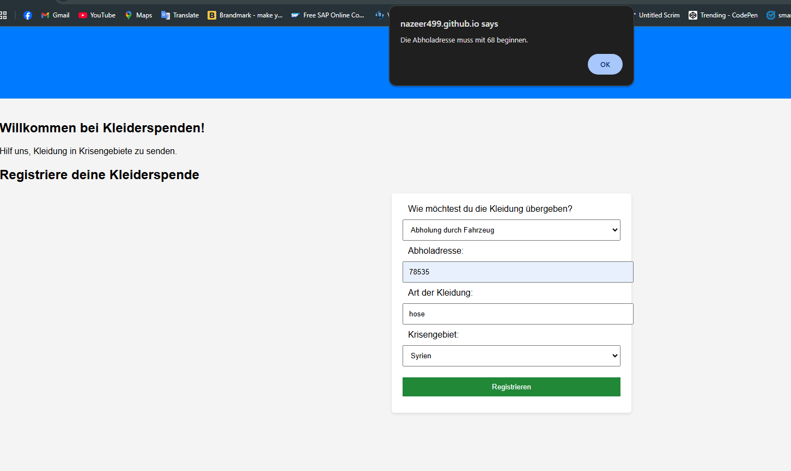
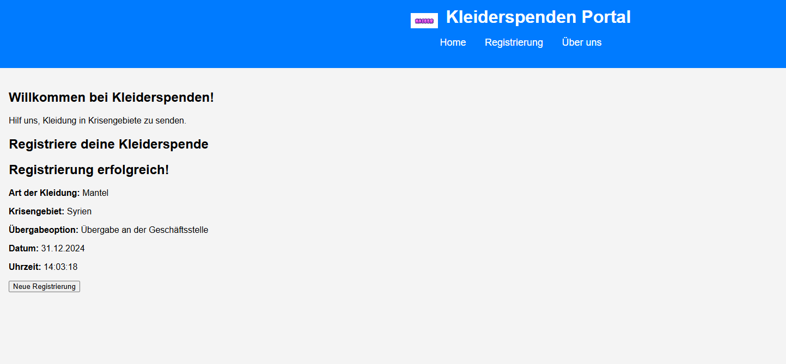

# kleiderspenden-portal
##Projektidee
dieses Projekt ist ein website um spende fur Ukraine und syrien zur registrierung 

## wie es funktioniert
- 2 möglichkeit zur lieferung :Büro oder Abholung
- Abholadresse bestätigen: Überprüfen Sie, ob die Postleitzahl in der Nähe des Büros liegt.
- Nach erfolgreicher Registrierung zeigt eine Bestätigungsmeldung.

## Test und Ergebnisse

*Abholadresse mit falscher Postleitzahl:**
   - Eingabe: 79100 
   - Ergebnis: Fehlermeldung Die Abholadresse ist weit von Geschäftsstelle.

**Abholadresse mit richtiger Postleitzahl:**
   - Eingabe: 68159 
   - Ergebnis: Erfolgreiche Registrierung und Bestätigungsanzeige.

### Screenshots

Nutzung

online benutzen:
https://nazeer499.github.io/kleiderspenden-portal/

Projekt Repository kopieren dieser Link:
https://github.com/nazeer499/kleiderspenden-portal
